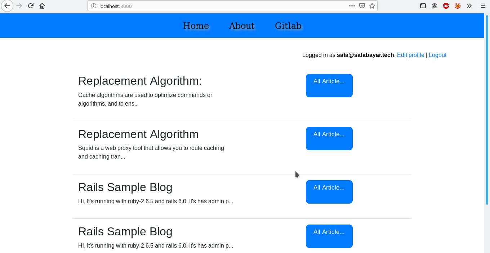

# Rails Sample Blog

Hi, It's running with ruby-2.6.5 and rails 6.0. It's has admin panel and you can login and sign up. This is live in [Heroku](https://serene-anchorage-83026.herokuapp.com).

The main page:


If you want to use, you need to apply this commands;

+ First you need to installed rvm. You can install in [here](https://rvm.io/rvm/install). These commands preparing for run rails application.

```
rvm install ruby-2.6.5
rvm use ruby-2.6.5
rvm gemset create blog
rvm use ruby-2.6.5@blog
```

+ You need to install gems and configure postgreSQL connection. It might be install postgreSQL and postgreSQL-devel. I used PostgreSQL 11 but you have to use up to PostgreSQL 10 version.

```
RAILS ENV=development bundle install
RAILS ENV=development bundle exec db:setup
RAILS ENV=development bundle exec db:migrate
```

+ You can run with;

```
RAILS ENV=development rails server
```

+ If you want to run rspec tests;

```
rspec spec/
```

* Ruby version => 2.6.5

* System dependencies => 

+ PostgreSQL 11
+ rvm

* Deployment instructions

```
git clone https://gitlab.com/rection/WorkofRails
cd WorkofRails
```

Rvm installation need to do and that is upside.

```
RAILS ENV=production bundle install
RAILS ENV=production bundle exec db:setup
RAILS ENV=production bundle exec db:migrate
```

The last step is running unicorn.

```
RAILS ENV=production rails server
```


I use reverse proxy on Nginx. That's change with your style.
